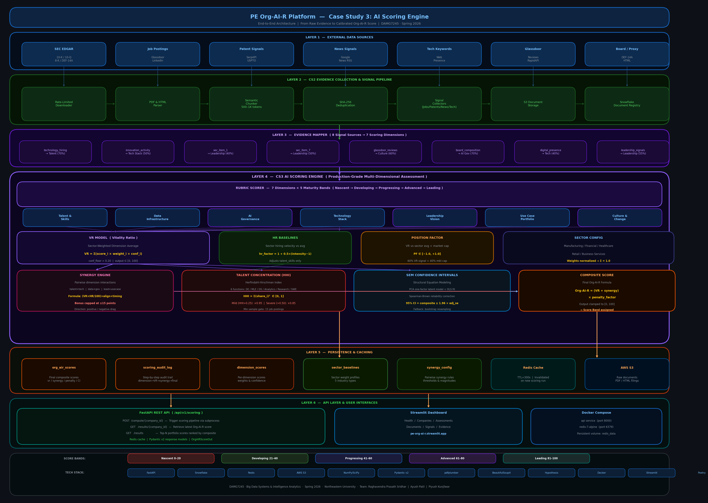

# Case Study 3 — AI Scoring Engine for Organizational AI Readiness

Course: DAMG 7245 – Big Data Systems & Intelligence Analytics
Term: Spring 2026
Instructor: Sri Krishnamurthy
Program: MS in Information Systems, Northeastern University

---

## Team Members

Ayush Patil,
Piyush Kunjilwar,
Raghavendra Prasath Sridhar

---

## Overview

Case Study 3 (CS3) builds the **AI Scoring Engine** on top of the CS1 platform foundation and CS2 evidence collection pipeline. The primary objective is to design and implement a **production-grade, multi-dimensional scoring system** that transforms structured and unstructured enterprise evidence into a single calibrated **Org-AI-R score** — an Organizational AI Readiness score.

The engine applies **sector-weighted VR (Vitality Ratio) modeling**, rubric-based evidence scoring, synergy functions, talent concentration penalties, and **SEM-based confidence intervals** to produce defensible, auditable AI readiness assessments for a portfolio of 10 companies.

---

## Problem Statement

In enterprise and private equity contexts, AI readiness assessments must be:
- Quantitatively grounded and mathematically defensible
- Evidence-backed from verifiable external sources
- Sector-calibrated to reflect industry-specific AI maturity benchmarks
- Reproducible and auditable for investment and governance decisions
- Accompanied by confidence intervals that communicate uncertainty

Subjective scoring, spreadsheet-based models, or static rubrics are insufficient. CS3 addresses this gap by building a **fully automated scoring pipeline** that converts evidence collected in CS2 into a composite Org-AI-R score with explainable dimension breakdowns and statistically rigorous confidence bounds.

---

## Objectives

- Design a 7-dimension AI readiness rubric with 5 maturity levels per dimension
- Implement sector-weighted VR (Vitality Ratio) modeling for cross-industry comparability
- Build a pairwise synergy engine to detect dimension interactions (bonuses and drag)
- Measure talent concentration risk using the Herfindahl-Hirschman Index (HHI)
- Calibrate scores with HR baselines derived from sector-level hiring signals
- Compute SEM-based confidence intervals to quantify assessment uncertainty
- Persist scoring results and full audit trails in Snowflake
- Expose scoring via a production-ready FastAPI REST API with Redis caching
- Validate the engine with 84 unit, integration, and property-based tests

---

## Codelabs Documentation

This project includes a step-by-step Codelabs walkthrough documenting the complete
scoring engine architecture, mathematical formulations, implementation details, and
deployment guide.

- **Google Doc (Public Viewer)**
  https://docs.google.com/document/d/1xVZpUCzNGW4Y2mIMuLDqoGXKM1ELrWF9MM5z3TRJk2c/edit

- **Codelab Preview**
  https://codelabs-preview.appspot.com/?file_id=1xVZpUCzNGW4Y2mIMuLDqoGXKM1ELrWF9MM5z3TRJk2c

The Codelab follows the official Google Codelab formatting guidelines and provides
a guided, reproducible walkthrough of the scoring architecture, rubric design,
VR model, synergy engine, SEM confidence intervals, and API deployment.

---

## Scoring Framework

### The 7 AI Readiness Dimensions

Each company is evaluated across 7 standardized dimensions of AI readiness:

| # | Dimension | Key Evidence Signals |
|---|---|---|
| 1 | **Talent & Skills** | ML teams, hiring velocity, AI skill keywords in job postings |
| 2 | **Data Infrastructure** | Data platforms, warehousing, pipelines, data engineering signals |
| 3 | **AI Governance** | CAIO presence, AI policies, board oversight, ethics committees |
| 4 | **Technology Stack** | MLOps tooling, LLMs, cloud AI platforms, tech keyword signals |
| 5 | **Leadership Vision** | AI strategy, executive sponsorship, MD&A disclosures |
| 6 | **Use Case Portfolio** | Production AI deployments, ROI disclosures, 8-K announcements |
| 7 | **Culture & Change** | Data-driven culture, Glassdoor innovation scores, employee signals |

### Maturity Bands

| Band | Score Range | Interpretation |
|---|---|---|
| Nascent | 0–20 | No meaningful AI readiness |
| Developing | 21–40 | Early-stage AI awareness forming |
| Progressing | 41–60 | Moderate capability, scaling needed |
| Advanced | 61–80 | Strong AI adoption, competitive |
| Leading | 81–100 | Market-leading AI readiness |

### Composite Score Formula

```
Org-AI-R = (VR + synergy_bonus) × penalty_factor

Where:
  VR             — sector-weighted Vitality Ratio       ∈ [0, 100]
  synergy_bonus  — pairwise dimension interaction score ∈ [−15, +15]
  penalty_factor — HHI talent concentration penalty     ∈ [0, 1]
```

---

## Portfolio Companies

| Ticker | Company | Sector |
|---|---|---|
| ADP | Automatic Data Processing | Business Services |
| CAT | Caterpillar | Manufacturing |
| DE | Deere & Company | Manufacturing |
| GS | Goldman Sachs | Financial Services |
| HCA | HCA Healthcare | Healthcare Services |
| JPM | JPMorgan Chase | Financial Services |
| PAYX | Paychex | Business Services |
| TGT | Target | Retail |
| UNH | UnitedHealth Group | Healthcare Services |
| WMT | Walmart | Retail |

---

## Scoring Pipeline Architecture

```
SEC Filings (CS2)            External Signals (CS2)
10-K / 10-Q / 8-K            Jobs / News / Patents / Tech
      │                              │
      └──────────┬───────────────────┘
                 ↓
         Evidence Mapper
   (8 signal sources → 7 dimensions)
                 │
                 ↓
       Rubric Scorer (7 Dimensions)
   Talent | Data Infra | AI Gov | Tech | Leadership | Use Case | Culture
                 │
        ┌────────┴────────┐
        ↓                 ↓
     VR Model         HR Baselines
  (sector weights)    (sector adjust)
        │                 │
        └────────┬────────┘
                 ↓
        Synergy Engine
     (pairwise + formula, ±15 cap)
                 │
                 ↓
      Talent Concentration (HHI)
          penalty_factor ∈ [0, 1]
                 │
                 ↓
     Composite = (VR + synergy) × penalty
     SEM Confidence Interval (lower, upper)
                 │
        ┌────────┴────────┐
        ↓                 ↓
  Snowflake DB       FastAPI REST API
 org_air_scores      /api/v1/scoring
 scoring_audit_log        │
                          ↓
                 Streamlit Dashboard
```

---

## Repository Structure

```
DAMG7245-CaseStudy-03-AI_Scoring_Engine/
├── .env.example
├── pyproject.toml
├── poetry.lock
├── README.md
├── docs/
│   └── evidence report.md
└── pe-org-air-platform/
    ├── requirements.txt
    ├── app/
    │   ├── main.py
    │   ├── config.py
    │   ├── database/
    │   │   └── schema.sql
    │   ├── models/
    │   │   ├── assessment.py
    │   │   ├── company.py
    │   │   ├── dimension.py
    │   │   ├── evidence.py
    │   │   ├── scoring.py
    │   │   └── signal.py
    │   ├── scoring_engine/
    │   │   ├── composite.py
    │   │   ├── dimension_pipeline.py
    │   │   ├── evidence_mapper.py
    │   │   ├── hr_baselines.py
    │   │   ├── integration_service.py
    │   │   ├── mapping_config.py
    │   │   ├── position_factor.py
    │   │   ├── rubric_scorer.py
    │   │   ├── sector_config.py
    │   │   ├── sem_confidence.py
    │   │   ├── synergy.py
    │   │   ├── talent_concentration.py
    │   │   ├── talent_penalty.py
    │   │   └── vr_model.py
    │   ├── pipelines/
    │   │   ├── board_analyzer.py
    │   │   ├── glassdoor_collector.py
    │   │   ├── job_signals.py
    │   │   ├── patent_signals.py
    │   │   ├── sec_edgar.py
    │   │   └── tech_signals.py
    │   ├── routers/
    │   │   ├── assessments.py
    │   │   ├── companies.py
    │   │   ├── collection.py
    │   │   ├── documents.py
    │   │   ├── evidence.py
    │   │   ├── health.py
    │   │   ├── scoring.py
    │   │   └── signals.py
    │   └── services/
    │       ├── evidence_store.py
    │       ├── redis_cache.py
    │       ├── s3_storage.py
    │       ├── scoring_service.py
    │       ├── signal_store.py
    │       └── snowflake.py
    ├── scripts/
    │   ├── apply_schema.py
    │   ├── backfill_companies.py
    │   ├── collect_evidence.py
    │   ├── collect_signals.py
    │   ├── compute_dimension_scores.py
    │   ├── run_scoring_engine.py
    │   └── seed_scoring_config.py
    ├── streamlit/
    │   └── app.py
    ├── tests/
    │   ├── conftest.py
    │   ├── test_api.py
    │   ├── test_hr_baselines.py
    │   ├── test_models.py
    │   ├── test_property_hypothesis.py
    │   ├── test_scoring_api.py
    │   ├── test_scoring_engine_components.py
    │   ├── test_sec_edgar.py
    │   ├── test_signals.py
    │   ├── test_synergy.py
    │   ├── test_talent_penalty.py
    │   └── test_vr_model.py
    └── docker/
        ├── Dockerfile
        └── docker-compose.yml
```

---

## Key Design Decisions

### Sector-Weighted VR Modeling

A single universal weight vector cannot fairly compare a Financial Services firm (where AI governance is paramount) to a Manufacturing firm (where technology stack integration dominates). Each sector maintains its own dimension weight profile, normalized to sum to 1.0. This ensures cross-industry comparability without flattening sector-specific AI readiness patterns.

### Confidence Floor in VR Calculation

A minimum confidence floor of 0.20 is applied to every dimension. This prevents zero-evidence dimensions from silently excluding themselves from the weighted average, ensuring that the VR score always reflects the full 7-dimension picture even when evidence is sparse.

### Pairwise Synergy Detection

Dimensions do not exist in isolation. Strong talent without strong data infrastructure creates execution risk; strong leadership without a use case portfolio signals aspirational but unproven AI capability. The synergy engine captures these interactions explicitly and adjusts the score accordingly, capped at ±15 points to prevent compounding distortions.

### HHI-Based Talent Concentration Penalty

The Herfindahl-Hirschman Index (HHI) — a standard measure of market concentration — is applied to a company's AI job function distribution across 6 categories (data engineering, ML engineering, data science, analytics, AI research, software engineering). Overconcentration in any single function reduces the composite score by up to 15%.

### Minimum Sample Gate for Talent Penalty

A minimum of 15 job postings is required before the HHI penalty is applied. This prevents noisy signals from small samples from unfairly penalizing companies with limited job posting data at the time of assessment.

### SEM-Based Confidence Intervals

A simplified Structural Equation Modeling approach — PCA-based one-factor latent modeling with OLS regression and Spearman-Brown reliability correction — produces 95% confidence intervals around each composite score. This communicates assessment uncertainty to practitioners, enabling more nuanced investment and governance decisions.

### Full Audit Trail

Every scoring run records intermediate results at each pipeline stage (dimension scoring, VR model, HR/position adjustment, synergy, SEM, final write) to a `scoring_audit_log` table in Snowflake. This enables full reproducibility and post-hoc inspection of every scoring decision.

### Redis Caching

All API scoring results are cached in Redis with a configurable TTL (default: 300 seconds). Cache entries are automatically invalidated when a new scoring run completes for the same company, ensuring freshness without sacrificing API performance under load.

---

## Evidence Sources

### SEC Filings (from CS2 Pipeline)

| Filing | Content Used |
|---|---|
| **10-K** | Business strategy, AI disclosures, risk factors, R&D investments, MD&A narratives |
| **10-Q** | Quarterly progress on AI initiatives, updated risk disclosures |
| **8-K** | AI leadership hires, acquisitions, material AI-related announcements |
| **DEF-14A** | Board AI expertise, governance oversight, committee composition |

### External Signals (from CS2 Pipeline)

| Signal | Source | Dimensions Impacted |
|---|---|---|
| Job postings | Glassdoor / LinkedIn | Talent, Technology Stack, Culture |
| Patent filings | SerpAPI / USPTO | Technology Stack, Use Case Portfolio |
| News mentions | Google News RSS | Leadership Vision, Use Case Portfolio |
| Tech keywords | Web presence | Technology Stack, Data Infrastructure |
| Glassdoor reviews | RapidAPI | Culture, Talent, Leadership |
| Board composition | DEF-14A proxy HTML | AI Governance, Leadership |

---

## Testing Strategy

### Unit Tests

- Rubric scoring logic and keyword matching
- VR model bounds verification (score always ∈ [0, 100])
- Synergy cap enforcement (bonus always ∈ [−15, +15])
- HHI calculation correctness and concentration classification
- HR adjustment scope (only modifies `talent_skills`, caps at 100)
- Evidence mapper dimension coverage and confidence propagation

### Integration Tests

- End-to-end scoring pipeline via the integration service
- Snowflake persistence and audit log entries
- FastAPI scoring endpoint request/response validation
- Redis cache invalidation on new scoring run

### Property-Based Tests (Hypothesis)

Using the **Hypothesis** framework with 500 random examples per test:

- VR score is always bounded in [0, 100] for any valid dimension input
- VR is monotonically non-decreasing when all dimension scores improve
- Talent risk adjustment is monotonically inverse to concentration (higher HHI → lower adjustment)
- Evidence mapper always returns all 7 dimensions regardless of input coverage

```bash
cd pe-org-air-platform
pytest tests/ -v
```

---

## Outputs

This case study produces:

- A calibrated **Org-AI-R composite score** (0–100) for each portfolio company
- A **named maturity band** (Nascent / Developing / Progressing / Advanced / Leading)
- **SEM-based 95% confidence intervals** (lower bound, upper bound, standard error)
- A full **7-dimension score breakdown** with sector weights and per-dimension confidence values
- An **activated synergy report** showing which dimension pairs triggered bonuses or drag
- An **HHI talent concentration report** with job function distribution and applied penalty
- A complete **scoring audit trail** in Snowflake for every pipeline stage
- Persisted scores in `org_air_scores` table, queryable via REST API

---

## Streamlit Application

The Streamlit dashboard provides an end-to-end interface for the full PE Org-AI-R platform:

- **Health Check** — Verify API, Snowflake, Redis, and S3 connectivity
- **Companies** — Add, view, and manage portfolio companies
- **Assessments** — Create assessments and trigger scoring runs
- **Documents** — Collect SEC filings and browse chunked evidence
- **Signals** — Collect and inspect external AI signals by category
- **Evidence** — Review company-level evidence and backfill missing data


This project is hosted [here](https://pe-org-ai-readiness.streamlit.app/)

Backend (API endpoints) is hosted [here](https://damg-7245-case-study-03-ai-scoring-engine-2trsi90vf.vercel.app)


---

## Architecture Diagram

The system architecture diagram illustrating ingestion, processing, storage, and data flow can be found below:



---


## Video Recording

A walkthrough video explaining the system design, pipeline execution, and outputs is available at:

[](https://www.youtube.com/watch?v=xkXbRhARyAI)

> **PE Org AI R Platform – Financial Grade AI Scoring Engine | Case Study 3**

---

## How to Run

### 1. Install dependencies

```bash
cd pe-org-air-platform
pip install -r requirements.txt
```

### 2. Configure environment

```bash
cp .env.example .env
# Fill in Snowflake, Redis, AWS, SEC, SerpAPI, and RapidAPI credentials
```

### 3. Apply the database schema

```bash
python scripts/apply_schema.py
```

### 4. Backfill portfolio companies

```bash
python scripts/backfill_companies.py
```

### 5. Collect SEC evidence (from CS2)

```bash
python scripts/collect_evidence.py
```

### 6. Collect external signals (from CS2)

```bash
python scripts/collect_signals.py
```

### 7. Run the scoring engine

```bash
# Score a single company
python scripts/run_scoring_engine.py --company-id <uuid>

# Score all companies with assessments
python scripts/run_scoring_engine.py --batch

# Score specific tickers
python scripts/run_scoring_engine.py --tickers JPM,WMT,GS,ADP,UNH
```

### 8. Start the FastAPI server

```bash
uvicorn app.main:app --host 0.0.0.0 --port 8000 --reload
```

### 9. Start the Streamlit dashboard

```bash
streamlit run streamlit/app.py
```

### 10. Run using Docker

```bash
docker compose -f docker/docker-compose.yml up --build
```

---

## Tech Stack

| Layer | Technology |
|---|---|
| **API Framework** | FastAPI (Python 3.12) |
| **Data Validation** | Pydantic v2 |
| **Data Warehouse** | Snowflake |
| **Caching** | Redis 7 |
| **Object Storage** | AWS S3 |
| **Statistical Modeling** | NumPy, SciPy (SEM / PCA) |
| **Document Parsing** | pdfplumber, BeautifulSoup4, lxml |
| **Testing** | pytest, Hypothesis (property-based) |
| **Dashboard** | Streamlit |
| **Containerization** | Docker, Docker Compose |
| **Dependency Management** | Poetry |

---

## Team Member Contributions

| Team Member | Contributions |
|---|---|
| **Raghavendra Prasath Sridhar** | SEC EDGAR pipeline, Snowflake schema design, scoring audit trail, batch scoring orchestration |
| **Ayush Patil** | Rubric scorer, synergy engine, evidence mapper, signal collection pipelines, test coverage |
| **Piyush Kunjilwar** | VR model, SEM confidence intervals, HR baselines, FastAPI endpoints, Streamlit dashboard, Docker deployment |

---

## AI Usage Disclosure

| Tool | Usage |
|---|---|
| **Claude (Anthropic)** | Architecture review, code quality feedback, documentation generation |
| **GitHub Copilot** | Boilerplate generation, test scaffolding |

---

## Key Takeaways

- Multi-dimensional AI readiness scoring requires explicit sector calibration — a single weight vector is insufficient for cross-industry comparison
- Mathematical rigor (VR formulas, HHI, SEM confidence intervals) transforms subjective assessments into defensible, auditable scores
- Synergy effects between AI readiness dimensions are real and measurable — talent without infrastructure creates execution drag
- Property-based testing (Hypothesis) provides stronger mathematical guarantees than hand-written unit tests alone
- Full audit trails are a first-class requirement in production scoring systems — every decision must be inspectable and reproducible
- This pipeline mirrors the analytical rigor expected in production private equity AI due diligence workflows


